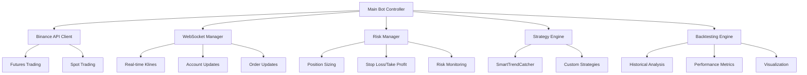

# 🚀 Advanced Binance Trading Bot

[](https://www.python.org/downloads/)
[](LICENSE)
[](https://binance-docs.github.io/apidocs/)
[](https://www.binance.com/)

> **A sophisticated, AI-powered cryptocurrency trading bot with advanced risk management, multiple trading strategies, and comprehensive backtesting capabilities.**

Created by **[Minhajul Islam](https://github.com/minhajulislamme)** | 📧 Professional Trading Solutions

---

## 🌟 **Key Features**

### 📊 **Advanced Trading Strategies**

- **PurePriceActionStrategy**: Pure price action analysis with mathematical calculations
- **MathematicalMomentumStrategy**: Statistical momentum and Fibonacci-based analysis
- **No Traditional Indicators**: Pure price movement analysis without lagging indicators
- **Multi-timeframe Analysis**: 1m to 1M timeframe support
- **Real-time Signal Generation**: WebSocket-based live data processing

### 🛡️ **Enterprise-Grade Risk Management**

- **Dynamic Position Sizing**: Automatically adjusts position sizes based on account balance
- **Advanced Stop Loss**: Trailing stops with volatility-based adjustments
- **Take Profit Management**: Fixed and trailing take profit options
- **Margin Safety**: Built-in margin calculation and safety factors
- **Multi-instance Support**: Run multiple bots on different trading pairs

### 🧠 **Intelligent Features**

- **Comprehensive Backtesting**: Historical performance analysis with detailed metrics
- **Auto-compounding**: Reinvest profits automatically with performance-based adjustments
- **WebSocket Integration**: Real-time data streaming for instant trade execution
- **Telegram Notifications**: Live trading alerts and daily reports
- **Performance Analytics**: Detailed charts and trade analysis

### ⚡ **Production-Ready Infrastructure**

- **24/7 Operation**: Systemd service integration for continuous running
- **Error Recovery**: Automatic reconnection and fault tolerance
- **Logging System**: Comprehensive logging with rotation
- **State Management**: Persistent state across restarts
- **Health Monitoring**: Built-in status checking and alerts

---

## 🏗️ **System Architecture**



---

## 📋 **Quick Start Guide**

### 1️⃣ **Prerequisites**

```bash
# System Requirements
- Python 3.8 or higher
- Linux/Ubuntu (recommended) or Windows/macOS
- 4GB RAM minimum
- Stable internet connection
```

### 2️⃣ **Installation**

```bash
# Clone the repository
git clone https://github.com/minhajulislamme/trading-bot.git
cd trading-bot

# Run the automated setup
chmod +x setup.sh
./setup.sh
```

### 3️⃣ **Configuration**

```bash
# Copy environment template
cp .env.example .env

# Edit configuration (add your API keys)
nano .env
```

### 4️⃣ **Launch Trading Bot**

```bash
# Start the bot
./run_bot.sh

# Check status
./check_bot_status.sh

# Stop the bot (if needed)
./stop_bot_manual.sh
```

---

## ⚙️ **Configuration**

### 🔐 **API Configuration**

```env
# Binance API Credentials
BINANCE_API_KEY=your_api_key_here
BINANCE_API_SECRET=your_secret_key_here
BINANCE_API_TESTNET=false

# Trading Parameters
TRADING_SYMBOL=SOLUSDT
LEVERAGE=20
STRATEGY=SmartTrendCatcher
TIMEFRAME=5m
```

### 💰 **Risk Management**

```env
# Position Sizing
INITIAL_BALANCE=50.0
FIXED_TRADE_PERCENTAGE=0.20
MAX_OPEN_POSITIONS=3

# Stop Loss & Take Profit
USE_STOP_LOSS=true
STOP_LOSS_PCT=0.015
USE_TAKE_PROFIT=true
TAKE_PROFIT_PCT=0.06
TRAILING_STOP=true
```

### 📱 **Notifications**

```env
# Telegram Alerts
USE_TELEGRAM=true
TELEGRAM_BOT_TOKEN=your_bot_token
TELEGRAM_CHAT_ID=your_chat_id
SEND_DAILY_REPORT=true
```

---

## 🧪 **Trading Strategies**

### 📈 **PurePriceActionStrategy**

The flagship strategy using **pure price action analysis** with **mathematical calculations**:

#### **Core Components:**

- **Price Momentum**: Mathematical rate of change calculations
- **Volatility Analysis**: Statistical standard deviation measurements
- **Support/Resistance**: Dynamic level detection using local highs/lows
- **Breakout Detection**: Threshold-based breakout identification
- **Candlestick Patterns**: Pattern recognition using price relationships

#### **Signal Logic:**

```python
# BUY Signal
if bullish_breakout and positive_momentum and strong_volume:
    return "BUY"

# SELL Signal
elif bearish_breakdown and negative_momentum and strong_volume:
    return "SELL"

# HOLD Signal (Conflicting signals or ranging market)
else:
    return "HOLD"
```

#### **Key Benefits:**

- ✅ No lagging indicators - responds immediately to price changes
- ✅ Works in all market conditions (trending, ranging, volatile)
- ✅ Mathematical approach reduces emotional bias
- ✅ Pure price and volume analysis
- ✅ Dynamic support/resistance level detection

---

## 🔬 **Backtesting**

### **Comprehensive Historical Analysis**

```bash
# Backtest specific symbol and strategy
python main.py --backtest --symbol SOLUSDT --strategy PurePriceActionStrategy --start-date "30 days ago"

# Mathematical momentum strategy backtest
python main.py --backtest --symbol BTCUSDT --strategy MathematicalMomentumStrategy --start-date "90 days ago"

# Small account testing with pure price action
python main.py --backtest --small-account --symbol ADAUSDT --start-date "30 days ago"
```

### **Performance Metrics**

- 📊 **Total Return**: Percentage profit/loss
- 🎯 **Win Rate**: Percentage of winning trades
- 📉 **Maximum Drawdown**: Largest peak-to-trough decline
- 💰 **Profit Factor**: Gross profit / Gross loss
- 📈 **Sharpe Ratio**: Risk-adjusted returns
- 🔄 **Trade Frequency**: Average trades per day

### **Validation Requirements**

```python
# Minimum performance thresholds for live trading
BACKTEST_MIN_PROFIT_PCT = 10.0    # Minimum 10% profit
BACKTEST_MIN_WIN_RATE = 40.0      # Minimum 40% win rate
BACKTEST_MAX_DRAWDOWN = 30.0      # Maximum 30% drawdown
BACKTEST_MIN_PROFIT_FACTOR = 1.2  # Minimum 1.2 profit factor
```

---

## 📊 **Pine Script Indicators**

### **Custom TradingView Indicators**

#### 🔍 **ADX Filter (adx_filter_by_minhaz.pine)**

```pinescript
//@version=6
indicator("ADX Only By Minhaz", overlay=false)

// Exact match to pandas_ta ADX calculation
// Filters weak trends (ADX <= 20)
// Plots clean ADX line with threshold
```

#### 📈 **EMA Cross (ema_cross_by_minhaz.pine)**

```pinescript
//@version=6
indicator("EMA Cross By Minhaz", overlay=true)

// 10/30 EMA crossover signals
// Visual trend confirmation
// Matches bot strategy exactly
```

---

## 🔧 **Advanced Features**

### **Real-time WebSocket Integration**

```python
# Live data streaming
- Kline/Candlestick data
- Account balance updates
- Order execution updates
- Position changes
- Real-time price feeds
```

### **Automated Risk Management**

```python
# Dynamic position sizing based on:
- Account balance
- Volatility (ATR)
- Risk per trade
- Maximum position limits
- Margin requirements
```

### **Performance Monitoring**

```python
# Comprehensive tracking:
- Trade history and P&L
- Equity curve visualization
- Drawdown analysis
- Performance metrics
- Daily/weekly reports
```

---

## 📈 **Usage Examples**

### **Live Trading**

```bash
# Start live trading with default settings
python main.py

# Small account mode with custom symbol
python main.py --small-account --symbol XRPUSDT

# Custom strategy and timeframe
python main.py --symbol BTCUSDT --strategy SmartTrendCatcher --timeframe 15m

# Skip validation for immediate start
python main.py --skip-validation --symbol ETHUSDT
```

### **Testing & Analysis**

```bash
# Paper trading test
python main.py --test-trade --symbol SOLUSDT

# Strategy comparison backtest
python main.py --backtest --symbol ADAUSDT --start-date "60 days ago"

# Performance validation
python main.py --backtest --symbol BNBUSDT --validate-only
```

---

## 🛠️ **Project Structure**

```
tradingbot/
├── 📁 modules/                 # Core trading modules
│   ├── 🐍 binance_client.py   # Binance API integration
│   ├── 🧠 strategies.py       # Trading strategies
│   ├── ⚖️ risk_manager.py     # Risk management
│   ├── 🔌 websocket_handler.py # Real-time data
│   ├── 📊 backtest.py         # Backtesting engine
│   └── ⚙️ config.py           # Configuration management
├── 🐍 main.py                 # Main bot controller
├── 📋 requirements.txt        # Python dependencies
├── 🔧 setup.sh               # Automated setup script
├── ▶️ run_bot.sh              # Start trading bot
├── 🔍 check_bot_status.sh     # Status monitoring
├── ⏹️ stop_bot_manual.sh      # Stop bot safely
├── 📈 adx_filter_by_minhaz.pine # Custom ADX indicator
├── 📊 ema_cross_by_minhaz.pine  # Custom EMA indicator
└── 📝 README.md               # This documentation
```

---

## 🔒 **Security & Best Practices**

### **API Security**

- ✅ Use API keys with minimal required permissions
- ✅ Enable IP whitelisting on Binance
- ✅ Store credentials in environment variables
- ✅ Never commit API keys to version control
- ✅ Use testnet for development and testing

### **Risk Management**

- ✅ Start with small position sizes
- ✅ Always use stop losses
- ✅ Monitor bot performance regularly
- ✅ Keep detailed trading logs
- ✅ Test strategies thoroughly before live trading

### **System Security**

- ✅ Run bot on secure, dedicated server
- ✅ Keep system and dependencies updated
- ✅ Use firewall and security monitoring
- ✅ Regular backups of trading data
- ✅ Monitor for unusual activity

---

## 📊 **Performance & Monitoring**

### **Real-time Monitoring**

```bash
# Check bot status
./check_bot_status.sh

# View live logs
tail -f logs/trading_bot_$(date +%Y%m%d).log

# Monitor system resources
htop
```

### **Performance Reports**

- 📈 **Daily P&L Reports**: Automated daily summaries
- 📊 **Weekly Performance**: Comprehensive weekly analysis
- 📉 **Drawdown Alerts**: Automatic risk notifications
- 💰 **Trade Analytics**: Detailed trade-by-trade analysis

---

## 🐛 **Troubleshooting**

### **Common Issues**

#### **Connection Problems**

```bash
# Check internet connectivity
ping google.com

# Verify Binance API status
curl -X GET 'https://fapi.binance.com/fapi/v1/ping'

# Test API credentials
python -c "from modules.binance_client import BinanceClient; client = BinanceClient(); print(client.get_account_balance())"
```

#### **Permission Errors**

```bash
# Fix file permissions
chmod +x *.sh
chown -R $USER:$USER /path/to/tradingbot

# Virtual environment issues
rm -rf venv
./setup.sh
```

#### **Bot Not Starting**

```bash
# Check logs for errors
tail -100 logs/trading_bot_$(date +%Y%m%d).log

# Verify configuration
python -c "from modules.config import *; print('Config loaded successfully')"

# Test minimal functionality
python main.py --test-trade
```

---

## 🤝 **Contributing**

We welcome contributions from the community! Here's how you can help:

### **Development Setup**

```bash
# Fork and clone the repository
git clone https://github.com/yourusername/trading-bot.git
cd trading-bot

# Create development branch
git checkout -b feature/your-feature-name

# Install development dependencies
pip install -r requirements-dev.txt
```

### **Contribution Guidelines**

1. 🔍 **Code Review**: All changes require review
2. 🧪 **Testing**: Add tests for new features
3. 📝 **Documentation**: Update docs for changes
4. 🎯 **Focus**: Keep changes focused and atomic
5. 📋 **Standards**: Follow existing code style

### **Areas for Contribution**

- 📈 **New Trading Strategies**: Implement additional strategies
- 🔧 **Performance Optimization**: Improve execution speed
- 📊 **Enhanced Analytics**: Better reporting and visualization
- 🛡️ **Security Improvements**: Strengthen security measures
- 🐛 **Bug Fixes**: Fix reported issues
- 📝 **Documentation**: Improve guides and examples

---

## 📜 **License**

This project is licensed under the **MIT License** - see the [LICENSE](LICENSE) file for details.

### **Disclaimer**

⚠️ **Important**: Cryptocurrency trading involves substantial risk of loss. This bot is for educational and research purposes. Always:

- Start with small amounts
- Use testnet for learning
- Understand the risks involved
- Never invest more than you can afford to lose
- Monitor your trades regularly

---

## 👨‍💻 **About the Author**

### **Minhajul Islam**

🔗 **GitHub**: [https://github.com/minhajulislamme](https://github.com/minhajulislamme)  
💼 **Professional Trading Solutions Developer**  
🌟 **Cryptocurrency & Algorithmic Trading Specialist**

#### **Expertise**

- ⚡ **Algorithmic Trading**: Advanced trading bot development
- 📊 **Technical Analysis**: Custom indicator development
- 🛡️ **Risk Management**: Enterprise-grade risk systems
- 🔌 **Real-time Systems**: High-frequency trading infrastructure
- 📈 **Strategy Development**: Quantitative trading strategies

#### **Connect & Support**

- 🐙 **GitHub**: [minhajulislamme](https://github.com/minhajulislamme)
- 💬 **Issues**: Report bugs and request features
- 📧 **Professional Services**: Custom trading solutions available
- ⭐ **Support**: Star the repo if you find it useful!

---

## 🙏 **Acknowledgments**

- 🏪 **Binance**: For providing comprehensive API documentation
- 📊 **pandas-ta**: Technical analysis library
- 🐍 **Python Community**: For excellent trading libraries
- 📈 **TradingView**: Pine Script inspiration
- 🤝 **Open Source Community**: For continuous improvements

---

## 📈 **Project Stats**


---

<div align="center">

### 🚀 **Ready to Start Trading?**

[](https://github.com/minhajulislamme/trading-bot)
[](https://github.com/minhajulislamme/trading-bot/releases)
[](#quick-start-guide)

**⭐ Star this repository if you found it helpful!**

</div>

---

_Last Updated: June 2025 | Version: 2.1.0 | Made with ❤️ by [Minhajul Islam](https://github.com/minhajulislamme)_
